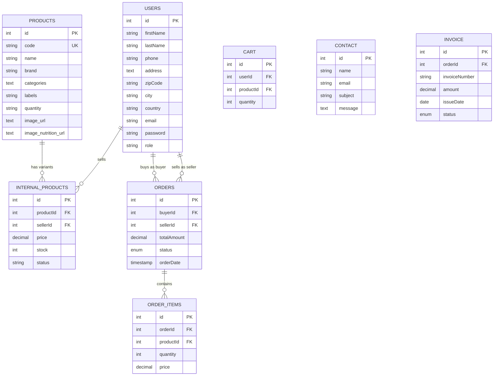

# Diagramme de la Base de Données

Ce diagramme représente la structure complète de la base de données de notre API, montrant toutes les tables et leurs relations.

## Description des Tables

### USERS
Table principale des utilisateurs pouvant être acheteurs ou vendeurs.
- Relations :
  * Peut vendre plusieurs produits (INTERNAL_PRODUCTS)
  * Peut avoir plusieurs commandes en tant qu'acheteur
  * Peut avoir plusieurs commandes en tant que vendeur

### PRODUCTS
Catalogue général des produits disponibles.
- Relations :
  * Peut avoir plusieurs variantes internes (INTERNAL_PRODUCTS)

### INTERNAL_PRODUCTS
Représente les produits spécifiques à chaque vendeur.
- Relations :
  * Appartient à un PRODUCT
  * Appartient à un vendeur (USER)

### ORDERS
Gestion des commandes.
- Relations :
  * Liée à un acheteur (USER)
  * Liée à un vendeur (USER)
  * Contient plusieurs ORDER_ITEMS

### ORDER_ITEMS
Détails des produits dans une commande.
- Relations :
  * Appartient à une commande (ORDER)
  * Référence un produit (PRODUCT)

### CART
Panier d'achats temporaire.
- Relations :
  * Lié à un utilisateur (USER)
  * Contient des références aux produits (PRODUCT)

### CONTACT
Stockage des messages de contact.
- Pas de relations directes avec d'autres tables

### INVOICE
Gestion des factures.
- Relations :
  * Liée à une commande (ORDER)
